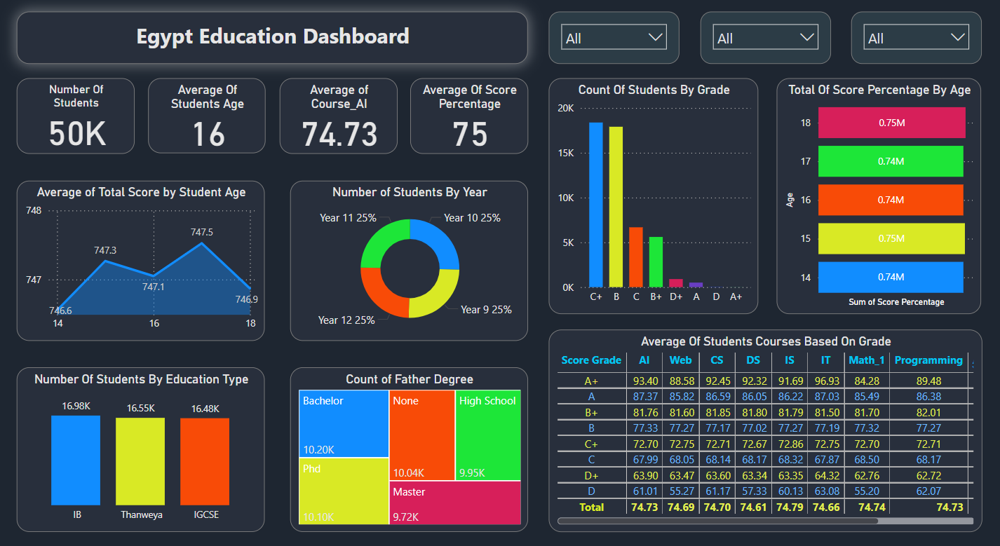

# Egypt Education Dashboard

This repository showcases a **Power BI dashboard** that provides insightful visualizations and detailed statistics on Egypt's educational system. The dashboard highlights key metrics such as student performance, demographics, and education trends, offering an interactive way to analyze data.

---

## 📊 Dashboard Features

###  **Overview**
- Total number of students: **50K**
- Average student age: **16 years**
- Average course AI score: **74.73**
- Average score percentage: **75%**

### 🔍 **Detailed Insights**
1. **Performance Analysis**:
   - Grade distribution of students (A+, A, B+, etc.).
   - Average course scores for AI, Web, CS, DS, IT, Math, and Programming.
2. **Demographics**:
   - Distribution of students by age, education type (IB, Thanaweya, IGCSE), and year.
   - Correlation between father’s education level and student performance.
3. **Visualization Types**:
   - Line chart: Age-based score trends.
   - Pie chart: Year-wise student percentage.
   - Bar chart: Total score percentages by grade.
   - Heatmap: Average course scores across grades.

---

## 📷 Screenshot

---

## ⚙️ Tools and Technologies

- **Power BI**: For creating dynamic, interactive dashboards and visualizations.
- **Data Analysis Techniques**: To extract meaningful insights from the data.

---
